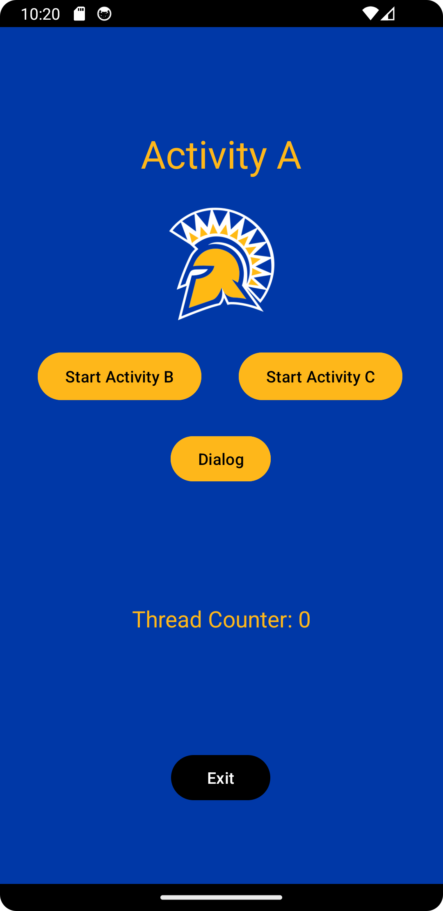
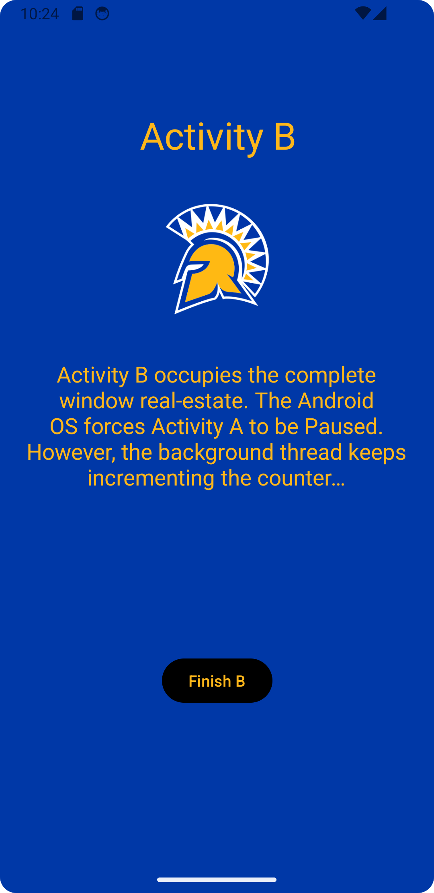
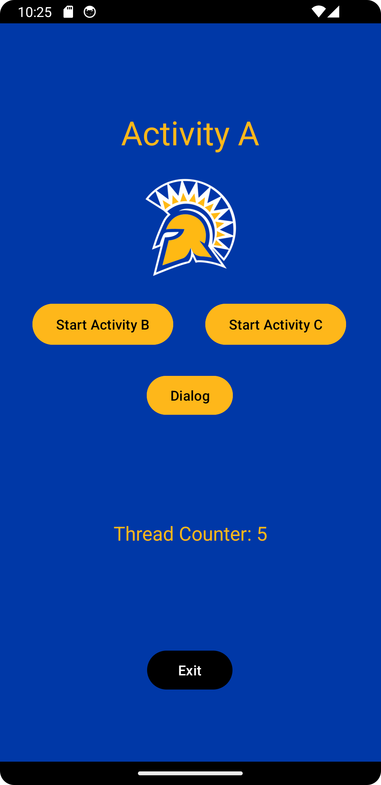
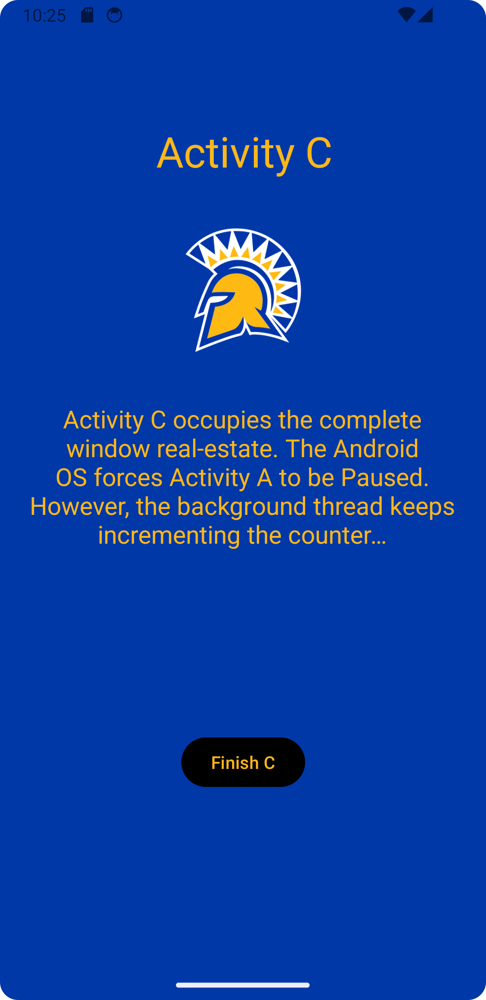
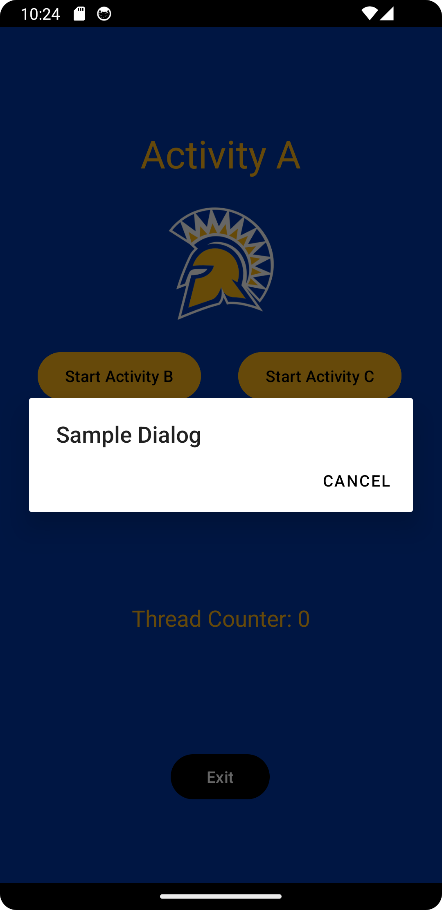

# CMPE277: Assignment 1 - Activity Life Cycle

## Assignmet Learning Objective

The purpose of the app is to understand the activity life cycle and the role of Android OS plays in handling life cycle events.

### Screenshots

## Authors

- [@Harshil-V](https://github.com/Harshil-V/) 
- [@Chandrasekar Vuppalapati](chandrasekar.vuppalapati@sjsu.edu)
